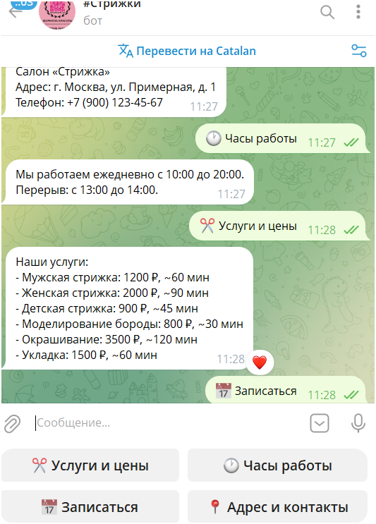

# 💇 ИИ-ассистент для парикмахерской «Стрижка» (Telegram-бот)

Telegram-бот — интеллектуальный ассистент салона красоты на базе **GigaChat**
(Sber). Ведёт естественный диалог с клиентами, отвечает на вопросы по базе знаний
(услуги, цены, часы работы) и записывает на приём с проверкой свободных слотов и
обеденного перерыва.

Проект реализует сценарий из [исходного описания](https://github.com/nifontovoleg/AI_assistent):
осмысленный диалог, ответы по базе знаний и запись на встречу.



---

## 📋 Содержание

- [Возможности](#-возможности)
- [Как это работает](#-как-это-работает)
- [Технологии](#-технологии)
- [Структура проекта](#-структура-проекта)
- [Установка](#-установка)
- [Получение ключей](#-получение-ключей)
- [Настройка](#-настройка-env)
- [Запуск](#-запуск)
- [Использование](#-использование)
- [Уведомления администраторам](#-уведомления-администраторам)
- [Google Calendar](#-google-calendar-необязательно)
- [Настройка под свой салон](#-настройка-под-свой-салон)
- [Хранение данных](#-хранение-данных)
- [Возможные проблемы](#-возможные-проблемы)
- [Идеи для развития](#-идеи-для-развития)

---

## ✨ Возможности

- **Живой диалог** на русском языке на базе LLM (GigaChat).
- **База знаний**: услуги, цены, длительность, адрес, телефон, часы работы.
- **Запись на приём** с проверкой:
  - часов работы (по умолчанию 10:00–20:00);
  - обеденного перерыва (13:00–14:00);
  - занятости слотов (нельзя записать двух клиентов на одно время);
  - прошедшего времени (нельзя записаться «назад»).
- **Кнопки в интерфейсе**:
  - постоянное нижнее меню (услуги, часы работы, запись, мои записи, контакты);
  - инлайн-кнопки выбора услуги при записи;
  - просмотр своих записей и отмена одной кнопкой.
- **Уведомления администраторам** — несколько аккаунтов через `ADMIN_ACCOUNTS`
  (`@username` и/или chat_id), в личные сообщения о записях и отменах.
- **Синхронизация с Google Calendar** (необязательно): записи дублируются в
  календарь, при отмене удаляются.
- **Учёт часового пояса** салона (по умолчанию Пермь / `Asia/Yekaterinburg`).
- **Хранение записей** в базе данных SQLite (`bookings.db`).

---

## ⚙️ Как это работает

```
Клиент ──▶ Telegram ──▶ bot.py ──▶ ai_assistant.py ──▶ GigaChat
                              │              │
                              │    function calling (get_available_slots,
                              │                     create_booking)
                              │              │
                              │         booking.py ──▶ database.py (SQLite)
                              │              │              │
                              │         knowledge_base.py   google_calendar.py
                              │
                              └──▶ уведомления админам (ADMIN_ACCOUNTS)
```

1. Клиент пишет боту в Telegram.
2. `bot.py` принимает сообщение и передаёт его ассистенту.
3. `ai_assistant.py` отправляет запрос в GigaChat вместе с описанием доступных
   функций (`get_available_slots`, `create_booking`).
4. Если для ответа нужны данные о расписании, модель **сама вызывает функцию** —
   бот выполняет её (`booking.py`), проверяет свободные слоты в БД и возвращает
   результат модели.
5. GigaChat формирует итоговый человекочитаемый ответ, который бот отправляет
   клиенту.

Такой подход (function calling) позволяет вести свободный диалог и при этом
выполнять реальные действия — проверку времени и создание записи.

---

## 🧰 Технологии

- **Python 3.10+**
- [python-telegram-bot](https://github.com/python-telegram-bot/python-telegram-bot) — Telegram Bot API
- [gigachat](https://github.com/ai-forever/gigachat) — официальный SDK GigaChat
- **SQLite** — хранение записей (встроено в Python)
- [python-dotenv](https://github.com/theskumar/python-dotenv) — переменные окружения

---

## 📁 Структура проекта

| Файл                | Назначение                                                   |
| ------------------- | ------------------------------------------------------------ |
| `bot.py`            | Точка входа: Telegram-бот, команды, кнопки, обработчики       |
| `ai_assistant.py`   | Интеграция с GigaChat и function calling                     |
| `booking.py`        | Логика расписания: свободные слоты, создание записи           |
| `database.py`       | Хранилище записей (SQLite)                                    |
| `knowledge_base.py` | База знаний салона (услуги, цены, часы работы, контакты)      |
| `keyboards.py`      | Клавиатуры Telegram (нижнее меню и инлайн-кнопки)             |
| `google_calendar.py`| Опциональная синхронизация записей с Google Calendar         |
| `config.py`         | Настройки из переменных окружения (`.env`)                   |
| `requirements.txt`  | Зависимости проекта                                          |
| `.env.example`      | Шаблон файла окружения                                        |

---

## 🚀 Установка

```bash
# 1. Клонировать репозиторий
git clone https://github.com/nifontovoleg/strizhka-ai-bot.git
cd strizhka-ai-bot

# 2. Создать виртуальное окружение
python -m venv .venv

# Windows (PowerShell):
.venv\Scripts\Activate.ps1
# Linux / macOS:
# source .venv/bin/activate

# 3. Установить зависимости
pip install -r requirements.txt
```

---

## 🔑 Получение ключей

### Токен Telegram-бота

1. Откройте [@BotFather](https://t.me/BotFather) в Telegram.
2. Отправьте команду `/newbot` и следуйте инструкциям (имя и username бота).
3. BotFather пришлёт **токен** вида `123456789:AA...` — сохраните его.

### Ключ авторизации GigaChat

1. Зайдите в [Studio Sber](https://developers.sber.ru/studio).
2. Создайте проект **GigaChat API** (для физлиц — тариф Freemium).
3. Скопируйте **ключ авторизации** (Authorization key) — длинную строку в Base64.

---

## 🔧 Настройка (`.env`)

Скопируйте `.env.example` в `.env` и заполните значения:

```env
# Токен Telegram-бота от @BotFather
TELEGRAM_BOT_TOKEN=123456789:AA...

# Ключ авторизации GigaChat
GIGACHAT_CREDENTIALS=ваш_ключ_авторизации
# Тип доступа: GIGACHAT_API_PERS (физлица), GIGACHAT_API_B2B или GIGACHAT_API_CORP
GIGACHAT_SCOPE=GIGACHAT_API_PERS
# Модель: GigaChat, GigaChat-Pro, GigaChat-Max
GIGACHAT_MODEL=GigaChat
# Проверка SSL (см. заметку ниже)
GIGACHAT_VERIFY_SSL=false
GIGACHAT_CA_BUNDLE_FILE=

# Часовой пояс салона (IANA), напр. Asia/Yekaterinburg (Пермь), Europe/Moscow
SALON_TIMEZONE=Asia/Yekaterinburg

# Админы для уведомлений о записях/отменах (личные сообщения от бота)
ADMIN_ACCOUNTS=@your_admin,5921878055

# Google Calendar (необязательно)
GOOGLE_CALENDAR_ENABLED=false
GOOGLE_CALENDAR_ID=primary
```

| Переменная                | Обязательна | Описание                                            |
| ------------------------- | :---------: | --------------------------------------------------- |
| `TELEGRAM_BOT_TOKEN`      |     ✅      | Токен бота от @BotFather                             |
| `GIGACHAT_CREDENTIALS`    |     ✅      | Ключ авторизации GigaChat                            |
| `GIGACHAT_SCOPE`          |     ❌      | Тип доступа (по умолч. `GIGACHAT_API_PERS`)          |
| `GIGACHAT_MODEL`          |     ❌      | Модель GigaChat (по умолч. `GigaChat`)               |
| `GIGACHAT_VERIFY_SSL`     |     ❌      | Проверять SSL-сертификаты (по умолч. `false`)        |
| `GIGACHAT_CA_BUNDLE_FILE` |     ❌      | Путь к CA-сертификату (для продакшена)               |
| `SALON_TIMEZONE`          |     ❌      | Часовой пояс салона (по умолч. `Europe/Moscow`)      |
| `ADMIN_ACCOUNTS`          |     ❌      | Админы для уведомлений: `@user`, chat_id через запятую |
| `GOOGLE_CALENDAR_ENABLED` |     ❌      | Включить синхронизацию с Google Calendar             |
| `GOOGLE_CALENDAR_ID`      |     ❌      | ID календаря (по умолч. `primary`)                   |

> **Про SSL.** GigaChat использует сертификаты «Russian Trusted Root CA».
> Для быстрого локального запуска оставьте `GIGACHAT_VERIFY_SSL=false`.
> Для продакшена скачайте сертификат с [Госуслуг](https://www.gosuslugi.ru/crt),
> укажите путь в `GIGACHAT_CA_BUNDLE_FILE` и поставьте `GIGACHAT_VERIFY_SSL=true`.

> ⚠️ **Безопасность.** Никогда не публикуйте `.env` и ключи в открытом доступе.
> Файл `.env` уже добавлен в `.gitignore`.

---

## ▶️ Запуск

```bash
python bot.py
```

После запуска в логах появится `Application started`. Напишите боту `/start`
в Telegram.

---

## 💬 Использование

### Команды

- `/start` — приветствие и показ меню.
- `/reset` — сбросить контекст беседы.
- `/mybookings` — показать свои записи с возможностью отмены.

### Кнопки нижнего меню

- **✂️ Услуги и цены** — список услуг с ценами.
- **🕐 Часы работы** — режим работы и перерыв.
- **📅 Записаться** — инлайн-кнопки выбора услуги.
- **🗓 Мои записи** — список записей и кнопка отмены.
- **📍 Адрес и контакты** — адрес и телефон салона.

### Пример диалога

```
Клиент: Хочу записаться на мужскую стрижку завтра
Бот:    Завтра свободны: 10:00, 10:30, 11:00, 11:30, 12:00,
        14:00, 14:30 ... Какое время удобно?
Клиент: На 13:00
Бот:    В 13:00 у нас перерыв. Могу предложить 12:00 или 14:00.
Клиент: Тогда на 14:00. Меня зовут Олег, +7 900 123-45-67
Бот:    Записываю на мужскую стрижку завтра на 14:00. Запись подтверждена!
        Придёт SMS-напоминание за день до визита.
```

---

## 🛠 Настройка под свой салон

Всё редактируется в `knowledge_base.py`:

- **Название, адрес, телефон** — `SALON_NAME`, `SALON_ADDRESS`, `SALON_PHONE`.
- **Услуги, цены, длительность** — словарь `SERVICES`
  (ключ → название, цена в ₽, длительность в минутах).
- **Часы работы и перерыв** — `OPEN_HOUR`, `CLOSE_HOUR`,
  `LUNCH_START_HOUR`, `LUNCH_END_HOUR`.
- **Шаг сетки записи** — `SLOT_STEP_MINUTES`.

---

## 🔔 Уведомления администраторам

Уведомления о **новых записях** и **отменах** приходят **только** на аккаунты из `.env`
— в **личные сообщения** с ботом (отдельный чат «бот ↔ админ»), а не в диалог клиента.

```env
# @username и/или числовой chat_id, через запятую
ADMIN_ACCOUNTS=@olegugfv_reg59,5921878055
```

| Формат | Пример | Как работает |
| --- | --- | --- |
| `@username` | `@olegugfv_reg59` | Админ один раз нажимает `/start` — бот запоминает его chat_id |
| `chat_id` | `5921878055` | Сразу, без `/start` (узнать у [@userinfobot](https://t.me/userinfobot)) |

> ⚠️ **Telegram не даёт боту писать первым.** Каждый админ с `@username` обязан
> нажать `/start`. После этого бот ответит: «Вы в списке администраторов».

> Если админ **сам записывается** через бота, служебное уведомление **не дублируется**
> в тот же чат — оно уходит только другим админам из списка. Для проверки используйте
> второй Telegram-аккаунт или попросите кого-то записаться.

Старые переменные `ADMIN_USERNAMES` / `ADMIN_CHAT_IDS` тоже поддерживаются.

---

## 📆 Google Calendar (необязательно)

Записи можно автоматически дублировать в Google Календарь.

1. В [Google Cloud Console](https://console.cloud.google.com/) создайте проект и
   включите **Google Calendar API**.
2. Создайте учётные данные **OAuth client ID** типа *Desktop app*, скачайте
   `credentials.json` и положите его в папку проекта.
3. В `.env` поставьте `GOOGLE_CALENDAR_ENABLED=true`.
4. При первом создании записи откроется браузер для авторизации Google — после
   входа рядом появится `token.json` (сохраняется автоматически).

Файлы `credentials.json` и `token.json` уже в `.gitignore` и не попадут в репозиторий.
Если интеграция выключена — бот работает штатно, только без синхронизации.

---

## 🗄 Хранение данных

Записи сохраняются в SQLite-файл `bookings.db` (создаётся автоматически).
Таблица `bookings`:

| Поле           | Тип     | Описание                     |
| -------------- | ------- | ---------------------------- |
| `id`           | INTEGER | Идентификатор записи          |
| `chat_id`      | INTEGER | ID чата Telegram              |
| `service`      | TEXT    | Название услуги               |
| `start`        | TEXT    | Дата и время начала (ISO)     |
| `end`          | TEXT    | Дата и время окончания (ISO)  |
| `client_name`  | TEXT    | Имя клиента                   |
| `client_phone` | TEXT    | Телефон клиента               |
| `gcal_event_id`| TEXT    | ID события в Google Calendar  |
| `created_at`   | TEXT    | Момент создания записи        |

Таблица `known_users` (сопоставление `@username` → `chat_id` для админов):

| Поле         | Тип     | Описание                              |
| ------------ | ------- | ------------------------------------- |
| `username`   | TEXT    | Telegram username (без `@`, lowercase) |
| `chat_id`    | INTEGER | ID личного чата с ботом               |
| `updated_at` | TEXT    | Последнее обновление                  |

---

## ❓ Возможные проблемы

- **`InvalidToken: ... rejected by the server`** — неверный `TELEGRAM_BOT_TOKEN`.
  Проверьте значение в `.env`. Если раньше задавали переменную окружения с тем же
  именем — она может перекрывать `.env`.
- **Ошибка SSL при обращении к GigaChat** — поставьте `GIGACHAT_VERIFY_SSL=false`
  для локального запуска или настройте `GIGACHAT_CA_BUNDLE_FILE` (см. про SSL выше).
- **`ZoneInfoNotFoundError`** — на Windows нужен пакет `tzdata` (он уже в
  `requirements.txt`, установите зависимости заново).
- **Неверные дата/время в подсказках** — проверьте `SALON_TIMEZONE`.
- **Уведомления админам не приходят** — проверьте `ADMIN_ACCOUNTS` в `.env`;
  каждый `@username` должен нажать `/start` у бота. Для проверки используйте
  запись с **другого** аккаунта (если админ сам записывается, уведомление
  в тот же чат не дублируется).
- **`409 Conflict: only one bot instance`** — запущено несколько копий бота.
  Остановите лишние процессы и оставьте один `python bot.py`.

---

## 🌱 Идеи для развития

- Реальная отправка SMS-напоминаний.
- Панель администратора со списком записей и расписанием.
- Перенос записи на другое время.
- Поддержка нескольких мастеров.

---

> Репозиторий: [github.com/nifontovoleg/strizhka-ai-bot](https://github.com/nifontovoleg/strizhka-ai-bot)

> Учебный проект. Логика салона (услуги, цены, часы) — демонстрационная,
> настраивается под конкретный бизнес.
